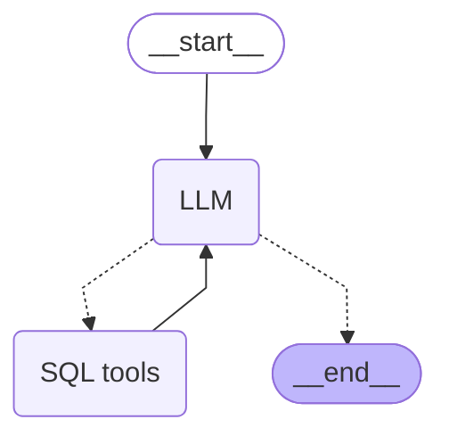

# Description
This is ExaGo.viz.ChatGrid agentic-AI server.

# 1. Installation process
## 1.1 Clone GitHub repo.
```bash
git clone -b 191-add-sql-context-management https://github.com/Walter462/ExaGO.git
```
## 1.2. Set API keys and database connection
Create a `.env` file.
```bash
# Go 
cd ExaGO/viz/chatgrid_backend             # go to backend folder
chatgrid_backend$ cp .env.example .env    # create your .env from sample
```
Open `.env` with any text editor and fill-in required data.

## 1.3. Set Python enviromnent

Do the following to install Python virtual environment and its all dependencies.
```bash
chatgrid_backend$ pip install -U uv           # install uv python environment manager
chatgrid_backend$ uv sync                     # install python venv and dependencies
```
# 2. Start app
## 2.1. Start the LangGraph Server.
```bash
chatgrid_backend$ uv run langgraph dev
```

>[!TIP]
>- Server runs at: http://127.0.0.1:2024 
>- Server API docs: http://127.0.0.1:2024/docs 

> Pop-up browser window
> 
> If you don't have LangSmith account and LangSmith API key.just close pop-up browser window (https://smith.langchain.com/studio/).

## 2.2. [Chat UI](../chatgrid_chat_ui/README.md)
[Run docker image](../chatgrid_chat_ui/README.md) and start your chat.

# 3. Current architecture agent diagram


SQL reading tools:
- check db connection
- get databases list
- get database tables
- get database schema