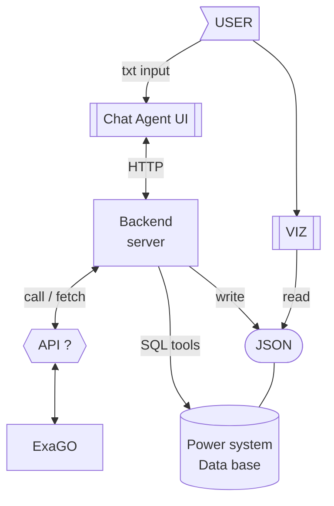
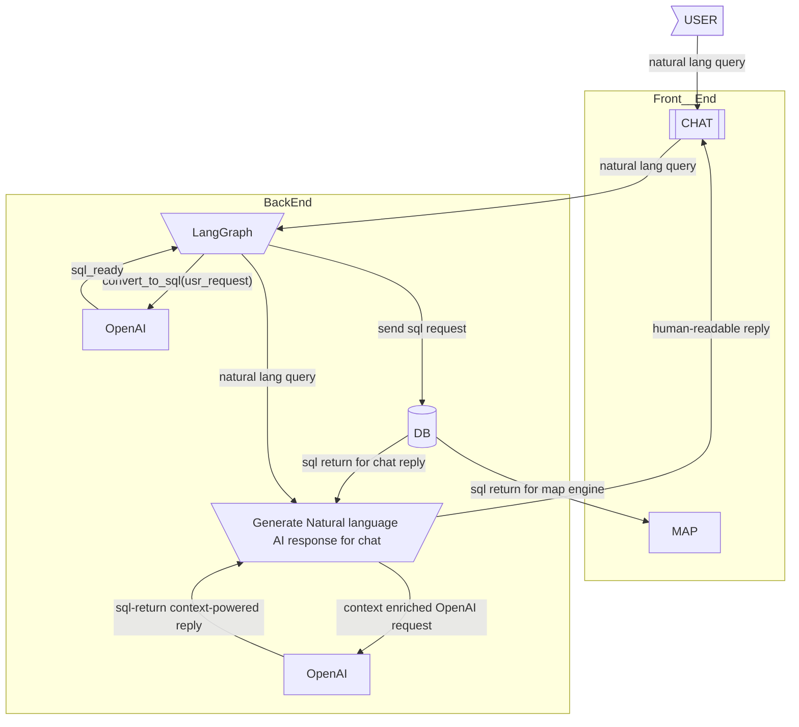

# APP architecture diagram

Major parts diagram 2.0

Diagram 1.0 

# Questions/suggestions
- [ ] Q: if I change [-2] messges can I return to [0] message of the previous branch? (frontend chat, backend feature) [created:: 2026-02-21]
#  To do

- [ ] (project notes) update Reading (SQL) architecture [App architecture](./20260110_onboarding.md#app-architecture-diagram) using LangGraph including: [created:: 2026-01-12]  [due:: 2026-02-09]
	- [Human in the loop](./20260111_architecture-human-in-the-loop.md)
	- [Security checks for SQL requests](./20260111_architecture-sql-requests-security.md)
	- [Context management](./20260111_architecture-context-management.md)
- [ ] (install) build ExaGo  [created:: 2026-01-11]
- [ ] (build) persistent storage: Server with SQL and Redis for chat state flow, data sandbox, and long-term user-chat consistency  (open-source version (aegra) [created:: 2026-02-08]  [due:: 2026-02-09]
	- [ ]  (build) agent server: multi-platfrom image. 
- [ ] (debug) langsmith debugger  ([vscode LangSmith debugger](https://docs.langchain.com/langsmith/quick-start-studio#optional-attach-a-debugger) )[created:: 2026-02-22]
- [ ] (feat) [LLM](https://docs.langchain.com/oss/python/integrations/providers/overview) provider and model selection  [created:: 2026-02-04]
	- configurable agent parameters. Define a model at runtime?
# DONE
- [x] V: (refactor) [`sqlchain.py`](https://github.com/Walter462/ExaGO/blob/my-cool-feature-dev/viz/backend/sqlchain.py) according to the notes I left in the file (marked with `[ ] V:`)  [created:: 2026-01-12]  [completion:: 2026-02-27]
	- [RESULT build server from scratch including logging, prompt engineering, splitting LLM and sql tools etc.](https://github.com/Walter462/ExaGO/tree/191-add-sql-context-management/viz/chatgrid_backend)
- [x] (debug) adopt logger  [created:: 2026-02-22]  [completion:: 2026-02-27]
- [x] (project notes) update architecture [App architecture](20260110_onboarding.md#app-architecture-diagram) Agentic features  (ChatGrid->LLM-> INput save -> ExaGo engine call -> OUTput save -> LLM -> ChatGrid) see - [Agentic architecture](./20260114_architecture-agentic-architecture-onboarding.md)  [created:: 2026-01-31]  [completion:: 2026-02-27]
- [x] V: build and start Viz in full[completion:: 2026-01-17] 
	- DONE: [ViZ app build task diary](./20260112_task-viz-build-diary.md)
- [x] V: build and start backend module [completion:: 2026-01-15] [task diary](./20260112_task-viz-build-diary.md)
	- DONE: [ViZ app build task diary](./20260112_task-viz-build-diary.md)
- [x] V: build and frontend modules [completion:: 2026-01-12] [task diary](./20260112_task-viz-build-diary.md)
	- DONE: [ViZ app build task diary](./20260112_task-viz-build-diary.md)
- [x] Agentic AI architecture  [created:: 2026-01-12]  [completion:: 2026-01-14]
	- DONE: Agentic AI (source 20260114 v, e gMeet [Agentic AI usecase](./attachments/20260115_agentic_AI_usecase.pptx)) 
- [x] Is there a document specifying the overall system requirements?  [completion:: 2026-01-12]
	- DONE: (see source: 2026-01-12 email s->)
- [x] Where is the VIZ module in relation to ExaGo?  [completion:: 2026-01-12]
  - DONE: (see source: 2026-01-12 email s->)

