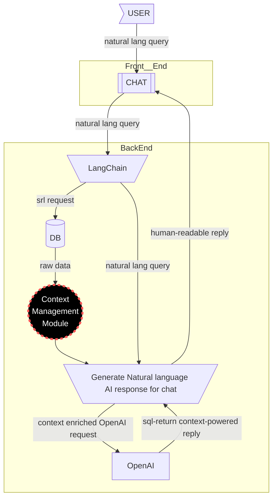

# Context management

SQL DB results for AI chat replies can be large and consume significant LLM tokens. On the other hand it is still limited by LLM context-window size and not all relevant data can be inputed. 
Model context-window limits (e.g. no it is 4k tokens) mean not all data may fit, possibly excluding important results (e.g., data from only one state in a multi-state query if rows are too many). Are we sure that the first 4k input from DB is the context we need? For example we get only ALabama for multi-state queries (state-ordered)? Filtering DB output in current architecture is crucial and the LLM context depends havily on sql filtering syntax (auto-genrated and unsupervised so far). 
One of the solution is to use pre-processing context model (like RAG for texts, adopting MCP) but not shure yet what kind of that is optimal. My be some promt-engeneering using sal response for 
Hence we have to ensure:
- sufficient token capacity,
- representative data picking in case token capacity insufficiency,
- appropriate context (format-specific) handling (check LLM outputs).

## Questions
- 20260113 V: What is the required token capacity (google.gemini up to 1kk tokens context window)
	- 2026018 V: We do not need full capacity (do not need to upload data into LLM).
	- 20260224 V: We can trigger human in-the loop to authorise aggregating and summarising tools/issues. 
- [x] [SQL steps](https://docs.langchain.com/oss/python/langgraph/sql-agent):  [completion:: 2026-02-21]
	- RESULT: [add logic to system prompt](https://github.com/Walter462/ExaGO/blob/191-add-sql-context-management/viz/chatgrid_backend/agent/prompts.py)
	- Listing DB tables
	- Calling the “get schema” tool
	- Generating a query
	- Authorise the query (human in the loop) (key editing words DROP, DELETE)
- [ ] Q: Token count and budgeting?
## To do  
- [ ] (build) delete unused files (looks like early LLM frontend implementations)[created:: 2026-02-02]
	- [ ] (test) collect and add usecases & delete  [dependsOn:: knt6gu]  [created:: 2026-02-02]  [due:: 2026-02-09]
	  - [viz/src/sqlagent.js](https://github.com/Walter462/ExaGO/blob/d7cd3146d96fd8b88958aeaa647b0667b92f40b4/viz/src/sqlagent.js)
	  - [viz/src/textagent.js](https://github.com/Walter462/ExaGO/blob/d7cd3146d96fd8b88958aeaa647b0667b92f40b4/viz/src/textagent.js)
	  - [https://github.com/Walter462/ExaGO/blob/d7cd3146d96fd8b88958aeaa647b0667b92f40b4/viz/src/jsonagent.js](https://github.com/Walter462/ExaGO/blob/d7cd3146d96fd8b88958aeaa647b0667b92f40b4/viz/src/jsonagent.js) 
- [ ] (test) adopt Unit tests, LLM judge. See: [LangChainTesting](https://docs.langchain.com/oss/python/langchain/test)  [created:: 2026-02-04]
- [ ] (test) pytest (test SQL reading tools). GutHub actions?
- [ ] (test) and check database from Eve  [created:: 2026-02-21]
- [ ] (feat) SQL context window overflow: suggest aggregating and summarizing ([[20260111_architecture-human-in-the-loop]]) [created:: 2026-02-22]
# Sources
## Postgres
- [short-term](https://docs.langchain.com/oss/python/langgraph/add-memory#add-short-term-memory) for thread-level [persistence](https://docs.langchain.com/oss/python/langgraph/persistence)
	- [langgraph.checkpoint-postgres](https://github.com/langchain-ai/langgraph/tree/114978b612050205eac6a92d069b90b8ab50d369/libs/checkpoint-postgres)
- [long-term](https://docs.langchain.com/oss/python/langgraph/add-memory#add-long-term-memory) Use long-term memory to store user-specific or application-specific data across conversations.

# Done
- [x] (feat) tool.fetch_sql_schema  [created:: 2026-02-02]  [due:: 2026-02-09]  [completion:: 2026-02-25]
	- [RESULT](https://github.com/Walter462/ExaGO/blob/191-add-sql-context-management/viz/chatgrid_backend/agent/tools.py#L200)
- [x] (upstream) Merge 5 tables into 2 (source: 2026-01-11 e talk) (affects LangChain schema)  [completion:: 2026-02-25]
	- [RESULT](https://github.com/pnnl/ExaGO/issues/191#issuecomment-3936027685)
- [x] (V) Explore options for context managemnt: RAG (Retrieval-Augmented Generation), MCP (Model Context Protocol), or other advanced methods. My experience is with RAG for text, not for structured tables or numeric data—need to evaluate applicability for tabular/coordinated data. #research (V). (source: 2026-01-11 V analysis in onboarding.md)  [created:: 2026-01-11]  [completion:: 2026-01-18]
  - RESULT: Use [LangGraph](https://www.langchain.com/langgraph) framework on the top of LangChain 
    - stateful (a state can be any dict) at any level (run, thread, application, session).
    - an easy way to log state through checkpointers
    - nodes and edges make it easier to visualise the application and work with
    - use functions, classes, oop, and more concepts to implement nodes and state.
    - pydantic support

- [x] (V) Raise Github issue on [Context Management Module](./20260111_architecture-context-management.md#context-management) (source: 2026-01-12 email s->)  [completion:: 2026-01-13]
  - RESULT: [Raised GitHub issue](https://github.com/pnnl/ExaGO/issues/191)