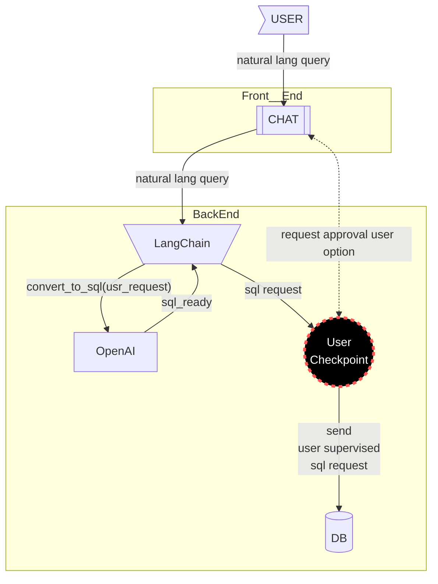

# User control of SQL requests

>[!TIP]
>ADOPT: Human in the loop concept via [LanGraph interrupts](https://docs.langchain.com/oss/python/langgraph/interrupts)

Should users be given the option to review and edit generated SQL queries before they are executed?


We cannot fully rely on LangChain’s sql_request output. There are scenarios in which a user may try different natural-language phrasings but still receive irrelevant or incorrect database results, which then appear both on the map and in the chat output. This creates a feedback loop where the user keeps rephrasing the request, yet the underlying SQL remains wrong.
Providing users with the option to inspect and edit the generated SQL before execution can break this loop. While many users will not know SQL, they could ask someone with SQL skills (for example, an engineer) to help. At the same time, SQL-savvy users could directly refine the query—for example, by fixing joins, filters, or sorting—to get the correct result.
In the current architecture, users have no way to intervene when the model generates incorrect SQL, so the system can get stuck in a cycle:

```
Natural-language request → incorrect SQL → wrong DB result →
user rephrases → incorrect SQL → wrong DB result
```

This capability must first be implemented on the backend, after which frontend controls can be added.
Possible frontend implementations include:
A popup that displays the generated SQL for review.
A checkbox such as “Let me review the SQL (expert option)”.
If enabled, the user can approve or modify the query; otherwise, it runs automatically.

## Questions

## To do
- [ ] (feat) Human-in-the-loop: SQL query monitoring and approval (e.g., writes to source DB, key words: DELETE, MERGE, DROP etc. ) and other runtime interruptions for human decisions (issue #191) [created:: 2026-02-22]
# DONE:
- [x] (V) Check if LangChain supports pre-execution editing of generated SQL (user input checkpoint). (source: V [2026-01-12 analysis `in onboarding.md`](./20260111_architecture-human-in-the-loop.md#user-control-of-sql-requests)) #research  [completion:: 2026-01-18]
	- RESULT: [Lang Graph](https://www.langchain.com/langgraph) adoption: [interruptions and human in the loop](https://docs.langchain.com/oss/python/langgraph/interrupts) [created:: 2026-01-18]

- [x] Should we implement human-in-the-loop  feature  [created:: 2026-01-11]  [completion:: 2026-01-14]
	- Example: (feat) backend handler for user checkpoint (SQL request syntax check/edit before it is submitted to DB)  [created:: 2026-01-16]
	- RESULT: YES (up to V (source: 20260114 v, v g-meet))