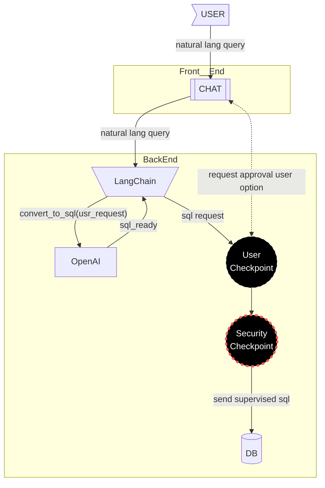

# Security checks for SQL requests

## Questions

- [ ] Q: Create special Agent read-only user? Which database (ChatGrid or spare one which is the main data source)?
- [ ] Q: Use 2 SQL databases: ChatGrid SandBox (depends on building with aegra) and Main(source DB)

## To DO
- [ ] (feat) create a special DB user for agent
- [ ] (feat) limit agent DB user rights on DB side (together with prompt engineering guardrails)  [created:: 2026-02-27]
# Sources
## Postgres
- [short-term](https://docs.langchain.com/oss/python/langgraph/add-memory#add-short-term-memory) for thread-level [persistence](https://docs.langchain.com/oss/python/langgraph/persistence)
	- [langgraph.checkpoint-postgres](https://github.com/langchain-ai/langgraph/tree/114978b612050205eac6a92d069b90b8ab50d369/libs/checkpoint-postgres)
- [long-term](https://docs.langchain.com/oss/python/langgraph/add-memory#add-long-term-memory) Use long-term memory to store user-specific or application-specific data across conversations.
# DONE  
- [x] (upstream) raise Github issue on security check (source: 2026-01-12 email s->)  [created:: 2026-01-12]  [completion:: 2026-02-25]
	- DONE: LLM prompt [read-only prompts](https://github.com/Walter462/ExaGO/blob/191-add-sql-context-management/viz/chatgrid_backend/agent/prompts.py)
- [x] Which SQL commands should be allowed? Should we restrict to read-only (SELECT) queries to eliminate risk from write/delete operations or AI mistakes? How robust are our protections against SQL injection or malformed queries?  [created:: 2026-01-11] [completion:: 2026-01-12]
  -  RESULT: new TODO (upstream) raise GitHub issue (see source: 2026-01-12 email s->)