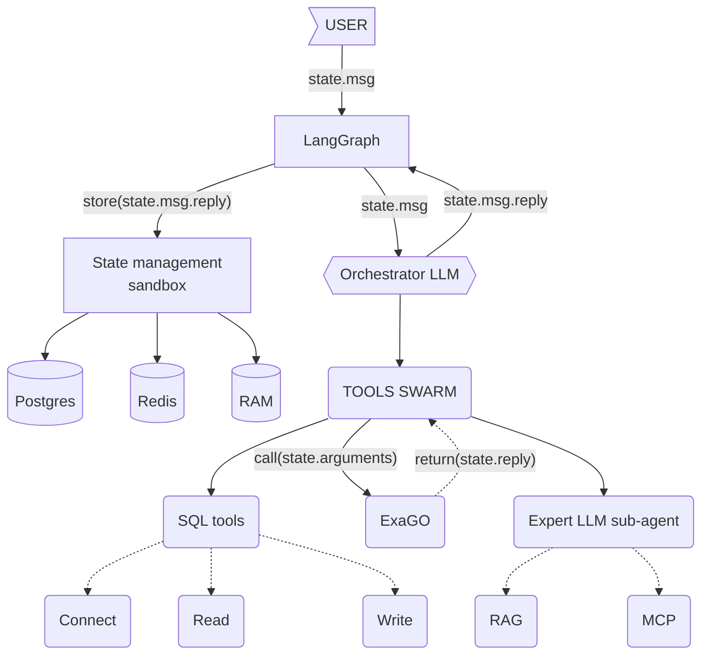

# Diagram 

# Agentic architecture
Eve mentioned an agentic architecture in which AI module (sorry for misunderstanding if I misinterpreted something) can, for example:
- write back into the system (updating a database or feeding outputs into the main ExaGo module)
- fetch data from ExaGo module at a certain `thinking` step 
- ask ExaGo to perform calculations and then act on the results
- validate intermediate results during `thinking` process.

That sounds very interesting and powerful. However, in the current [architecture we discussed above](./20260110_onboarding.md)), the system appears to be primarily read-only: the user submits a natural-language query and receives text and visualization outputs.
In addition, Slavin’s email suggests that ExaGo provides a JSON file to the Visualization API, which then serves as the source data for the map-building engine. Given this, it is not yet clear how the proposed agentic capabilities fit into the architecture, or how they connect back to the core ExaGo module.
Need clarification on how these agentic features are intended to work with this architecture. May be there is extended chart/text which describes this new part of the system we didn't discuss yet.
It would also be helpful to see a higher-level system document that describes the full platform we are building, including:
- its overall goals,
- core components and responsibilities,
- expected inputs, and
- what constitutes a successful or acceptable output.

Such a document would greatly help align everyone’s understanding of how the agentic layer, ExaGo, and the visualization system are intended to work together.

# Sources
## Postgres
- [short-term](https://docs.langchain.com/oss/python/langgraph/add-memory#add-short-term-memory) for thread-level [persistence](https://docs.langchain.com/oss/python/langgraph/persistence)
	- [langgraph.checkpoint-postgres](https://github.com/langchain-ai/langgraph/tree/114978b612050205eac6a92d069b90b8ab50d369/libs/checkpoint-postgres)
- [long-term](https://docs.langchain.com/oss/python/langgraph/add-memory#add-long-term-memory) Use long-term memory to store user-specific or application-specific data across conversations.

# TODO
- [ ] (build) offload SQL (parse) to .m by user request.  [created:: 2026-02-21]
- [ ] (feat) - Power systems expert LLM node: Load skills to LLM (MCP, RAG) before tool calling, or create a power-system expert sub-agent [Load skills to LLM before tool calling](https://docs.langchain.com/oss/python/langchain/multi-agent/skills-sql-assistant) (issue # 191) 

### Resolved
- [x] How to add agentic feature implementation  [completion:: 2026-01-15]
	- RESULT: See [Agentic AI usecase](./attachments/20260115_Agentic_AI_usecase.pptx) (source: 20260114 v, e g-meet)